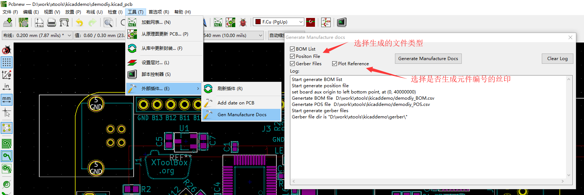

# KiCAD生产文件生成器

KiCad plot tool is forked from "https://github.com/blairbonnett-mirrors/kicad/blob/master/demos/python_scripts_examples/gen_gerber_and_drill_files_board.py"

S-Expression parse tool is forked from https://github.com/tkf/sexpdata


使用方法:

1 复制mf_tool.py gerber_drill.py loadnet.py	sexpdata.py 这四个文件到"[KiCad安装目录]\share\kicad\scripting\plugins" 路径下

2 在KiCAD的Python命令行窗口中键入下列命令：

```python
import mf_tool as mf
mf.GenSMTFiles()
```

3. 或者在[工具]->[外部工具]下执行Gen Manufacture Docs命令。



4 BOM文件和位置文件会以CSV格式存放在电路板相同目录下，gerber和钻孔文件放在电路板目录下的gerber目录中。通过此方法生成的钻孔文件中的槽孔会被转换成多个普通孔。

## 注意:

GenMFDoc() 会改变电路板的钻孔原点。建议先用GenMFDoc()生成BOM文件和位置文件，再生成Gerber文件。

生成的BOM文件和坐标文件以及gerber和钻孔文件可以直接在sz-jlc.com进行贴装


# Manufacture Tools for kicad

Usage:

step 1: Copy the mf_tool.py and gerber_drill.py to “[kicad install path]\share\kicad\scripting\plugins”

step 2: In Python console window, type 
```python
import mf_tool as mf
mf.GenSMTFiles()
```

step 3: or in [tools]->[external tools] menu, invoke the [Gen Manufacture Docs] command.

step 4: the BOM and Postion CSV file will be generated under the same folder of the board file。 Gerber and drill file is under the "gerber" folder. The slot hole in drill file will split to hole serires.

## Attention:

The GenMFDoc() command will change the Aux original point
